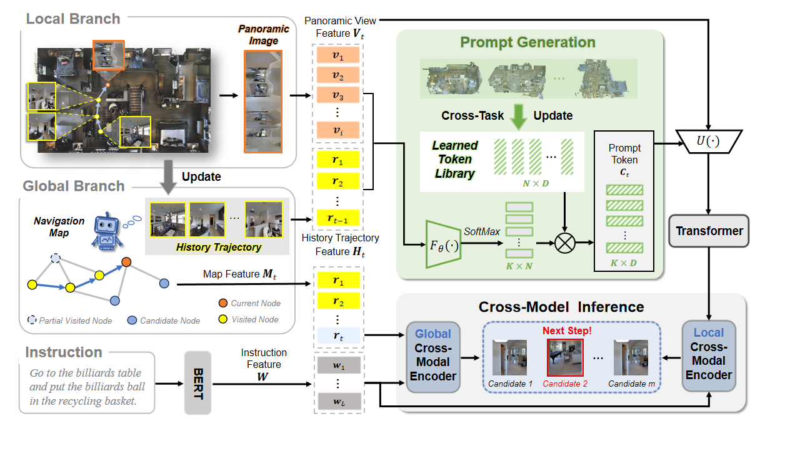

# History-Guided Prompt Generation For Vision-and-Language Navigation

Vision-and-Language Navigation (VLN) has garnered extensive attention in the field of embodied artificial intelligence. VLN involves time series information, where historical observations contain rich contextual knowledge and play a crucial role in navigation. However, current methods do not explicitly excavate the connection between rich contextual information in history and the current environment, and ignore adaptive learning of clues related to the current environment. Therefore, we explore a Prompt Learning-based strategy which adaptively mines information in history that is highly relevant to the current environment to enhance the agent’s perception of the current environment and propose a History-Guided Prompt Generation(HGPG) framework. Specifically, HGPG includes two parts, one is an entropy-based history acquisition module that assesses the uncertainty of the action probability distribution from the preceding step to determine whether historical information should be used at the current time step. The other part is the prompt generation module that transforms historical contextinto prompt vectors by sampling from an end-to-end learned token library. These prompt tokens serve as discrete, knowledge rich representations that encode semantic cues from historical observations in a compact form, making them easier for the decision network to understand and utilize. In addition, we share the token library across various navigation tasks, mining common features between different tasks to improve generalization to unknown environments. Extensive experimental results on four mainstream VLN benchmarks (R2R, REVERIE, SOON, R2R-CE) demonstrate the effectiveness of our proposed method.



## Requirements

1. Install Matterport3D simulators: follow instructions [here](https://github.com/peteanderson80/Matterport3DSimulator). We use the latest version instead of v0.1.
```
export PYTHONPATH=Matterport3DSimulator/build:$PYTHONPATH
```

2. Install requirements:
```setup
conda create --name HGPG python=3.9.0
conda activate HGPG
pip install -r requirements.txt
```

3. Download data from [Dropbox](https://www.dropbox.com/sh/u3lhng7t2gq36td/AABAIdFnJxhhCg2ItpAhMtUBa?dl=0), including processed annotations, features and pretrained models of REVERIE datasets. Put the data in `datasets' directory.

4. Download pretrained lxmert
```
mkdir -p datasets/pretrained 
wget https://nlp.cs.unc.edu/data/model_LXRT.pth -P datasets/pretrained
```

5. Download the resume_file from [Dropbox](https://www.dropbox.com/scl/fi/tq1b29vdir534lpzn1wv1/new_0.5_best_val_unseen?rlkey=jf15bcdgy7q6juh1vbb8zaykf&st=c2au8udk&dl=0), and modify the resume_file path in run_reverie.sh.
   
6. Download the bert-base-uncased from (https://huggingface.co/google-bert/bert-base-uncased), and modify the path in the [`map_nav_src/models/vlnbert_init.py`](./map_nav_src/models/vlnbert_init.py#L10).

## Fine-tuning & Evaluation

Use pseudo interative demonstrator to fine-tune the model:
```finetune
cd map_nav_src
bash run_reverie.sh
```

